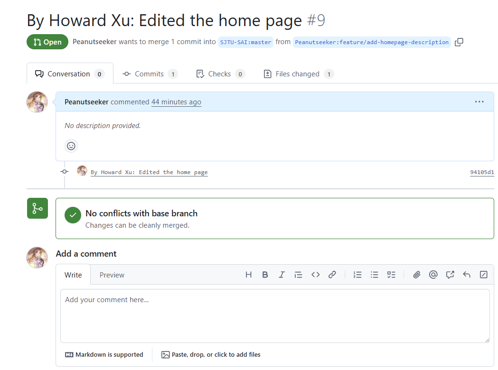

# Pull Request速通教程

官方完整教程：[Creating a Pull Request](https://docs.github.com/en/pull-requests/collaborating-with-pull-requests/proposing-changes-to-your-work-with-pull-requests/creating-a-pull-request)

以下是给想给本社区网站contribute的简易实操教程


!!! info "核心概念：什么是 Pull Request (PR)？"
    **Pull Request (拉取请求)** 是一种机制，让开发者可以将自己在一个分支（branch）上完成的改动，**提议（propose）**合并到仓库的另一个分支（通常是 `main` 或 `develop`）。

    它不是一个强制的命令，而是一个**发起讨论的平台**，以及 **一个更改请求（任何人都有权限发起 Pull Request）**。如果仓库的维护者对某个 Pull Request 感到满意，他会将这个 PR 合并。

---

### 完整工作流：从创建分支到合并 PR

本指南将以对本社区发起 PR 为例，展示完整操作流程。

!!! abstract "前提条件"
    - 你已经在本地计算机上安装了 Git。（Windows / Linux 均可）
    - 你有一个 GitHub 账户。
    - 你已经将目标仓库 `clone` 到了本地。（参考 **Local Launch** 栏目）

    !!! warning "特别说明：关于连接方式"
        本指南推荐使用 `SSH` 协议来操作 Git 仓库，这是相比 `HTTPS` 更稳定、更推荐的办法。如果尚未配置 SSH，请查阅相关资料或询问 AI。

---

=== "阶段 1: 准备与 Fork"

    1.  **创建一个 Fork 分支**
        在 GitHub 网站上，进入 `SAI-Community` 仓库主页，点击右上角的 **"Fork"** 按钮，创建属于你自己的副本 (`Your-Username/SAI-Community`)。

        [前往 SAI-Community 仓库 Fork](https://github.com/SJTU-SAI/SAI-Community){ .md-button }

        

    2.  **Clone 你的 Fork 仓库到本地**
        ```bash title="Clone 你的 Fork"
        # 将 "Your-Username" 替换为你的 GitHub 用户名
        git clone git@github.com:Your-Username/SAI-Community.git
        ```

    3.  **配置上游仓库 (Upstream)**
        将原始的官方仓库添加为上游（Upstream），方便未来同步官方更新。
        ```bash title="配置上游仓库"
        # 进入你刚刚 clone 的本地仓库目录
        cd SAI-Community
        # 添加官方仓库作为名为 "upstream" 的远程地址
        git remote add upstream git@github.com:SJTU-SAI/SAI-Community.git
        ```

=== "阶段 2: 本地开发"

    1.  **同步更新**
        在开始新工作前，先从上游仓库拉取最新代码，确保你的主分支是最新版本。
        ```bash title="同步上游更新"
        git checkout master  # 或 main
        git pull upstream master
        ```

    2.  **创建并切换到新分支**
        为你的新功能或修改创建一个独立的、有描述性的分支。
        ```bash title="创建新分支"
        # 分支名应清晰地描述其用途
        git checkout -b feature/my-new-feature
        ```

        !!! tip "分支命名规范建议"
            - `feature/功能描述` (e.g., `feature/user-login`)
            - `fix/问题描述` (e.g., `fix/navbar-alignment-bug`)
            - `docs/文档更新` (e.g., `docs/update-pr-guide`)


    3.  **修改代码并提交**
        完成你的代码修改，然后进行一次逻辑完整的提交。
        ```bash title="提交你的改动"
        # ...修改代码...

        # 添加指定文件到暂存区
        git add docs/your-file.md

        # 或者一次性添加所有修改（不建议，除非你清楚所有改动）
        # git add .

        # 提交改动，并附上有意义的提交信息
        git commit -m "Feat: Implement my new feature"
        ```

=== "阶段 3: 提交 PR"

    1.  **推送到你的 Fork**
        将你的新分支和所有提交推送到你自己的 Fork 仓库 (`origin`)。
        ```bash title="推送到你的 Fork"
        # -u 参数会自动将你的本地分支与远程分支关联起来
        # 后续对该分支的推送只需 git push 即可
        git push -u origin feature/my-new-feature
        ```

    2.  **在 GitHub 上创建 Pull Request**
        推送成功后，在浏览器中打开你的 Fork 仓库主页。通常会有一个黄色的提示条和一个绿色的 **"Compare & pull request"** 按钮。点击它，填写清晰的 PR 标题和描述，然后提交。接下来就是等待仓库管理者审查和合并。

        !!! example "成功提交PR后的页面示例"
            


---


### 附录：PR 进阶操作

???+ question "Addition 1: 如何修改一个已提交的 PR？"
    如果你需要根据反馈修改代码，操作非常简单：

    1.  确保你本地还在之前的开发分支上 (`feature/my-new-feature`)。
    2.  直接修改代码，然后像之前一样 `add` 和 `commit` 你的新改动。
        ```bash title="提交更新到已有PR"
        # (根据反馈修改代码...)
        git add .
        git commit -m "Fix: Address review feedback on error handling"

        # 再次推送到同一个远程分支 (这次不再需要 -u)
        git push origin feature/my-new-feature
        ```
    当你推送后，GitHub 上**同一个 PR 会自动更新**，并显示出你的新提交。

???+ danger "Addition 2: 如何处理合并冲突？"
    当你开发期间，主分支可能已被更新，这可能导致冲突。推荐使用 `rebase` 来保持你的分支历史整洁。

    1.  **同步并变基 (Rebase)**
        ```bash
        # 1. 确保 main 分支是最新
        git checkout main
        git pull upstream main

        # 2. 切换回你的功能分支
        git checkout feature/my-new-feature

        # 3. 将你的分支“变基”到最新的 main 分支之上
        git rebase main
        ```
    2.  **解决冲突**
        如果出现冲突 (Conflict)，Git 会暂停并提示。你需要：
        - 手动打开冲突文件，解决 `<<<<<`, `=====`, `>>>>>` 标记的部分。
        - 解决后，使用 `git add <resolved-file-name>` 标记文件已解决。
        - 继续 `rebase` 过程：`git rebase --continue`。

    3.  **强制推送**
        `rebase` 会重写提交历史，因此你需要强制推送。
        ```bash title="变基后强制推送"
        # --force-with-lease 是比 --force 更安全的选择，推荐使用
        git push --force-with-lease origin feature/my-new-feature
        ```

???+ success "Last Phase: PR 合并后的清理工作"
    PR 被合并后，为了保持仓库整洁，应该删除已完成使命的分支。

    1.  **删除远程分支**
        在 GitHub 上合并 PR 后，通常会有一个 "Delete branch" 的按钮，点击即可。

    2.  **删除本地分支**
        ```bash title="清理本地分支"
        # 1. 切换回主分支
        git checkout main

        # 2. 拉取最新代码（包含了你刚刚合并的PR）
        git pull upstream main

        # 3. 删除已经合并的本地分支
        git branch -d feature/my-new-feature
        ```

        !!! quote "关于 `-d` 和 `-D`"
            `-d` 选项是安全的，只有在分支被完全合并后才能删除。如果想强制删除一个未合并的分支，使用 `-D`。

    !!! tip "更新通知"
        当你的 PR 被 merge 之后，若想继续 contribute ，请优先参考下文的办法

至此，一个完整的 Pull Request 工作流程结束。:rocket:

---

!!! tip "Addition: 不删除本地Fork，继续发PR的方法"
    可以用 `Github` 上的 `sync Fork`
    1. 去 `Github` 上你的 `fork` 页面，看到右边有个 `sync Fork` 按钮，点击 `Update Branch` 完成更新
    
    2. 在本地执行以下三条命令：
    ```Bash
    git checkout master #查询主仓库更新
    git pull upstream master  #从上游官方仓库拉取更新
    git push origin master  #将更新后的本地主分支推送到你的origin（你的Fork）
    ```
    看到 `Everything up-to-date` 就表明你的分支仓库和官方进度同步了

    **==提醒：一定要确保你的本地Fork和官方进度同步再发起更新，不然版本冲突很麻烦==**


